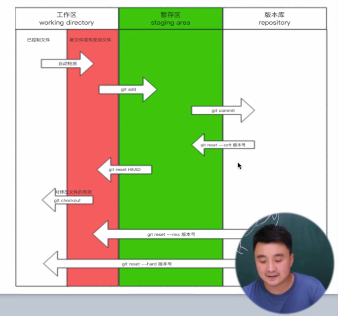

[git笔记链接](https://gitee.com/hongjilin/hongs-study-notes/tree/master/%E7%BC%96%E7%A8%8B_%E5%89%8D%E7%AB%AF%E5%BC%80%E5%8F%91%E5%AD%A6%E4%B9%A0%E7%AC%94%E8%AE%B0/Git%E5%AD%A6%E4%B9%A0%E7%AC%94%E8%AE%B0)

# 第一节 操作
## 一、整体操作
1. 进入要管理的目录
2. git init 初始化，让git帮我们管理当前文件夹
3. git status 检测当前目录下文件的状态
4. 三种状态的变化
    - 红色：新增文件 / 修改了原来老文件
  -->   **git add 文件名**
    * 绿色：git已经管理起来了 
  -->   **git commit -m '描述信息'**  
    * 个人信息配置：用户名、邮箱【一次即可】
    * 生成版本
    * 查看版本记录
  -->   **git log**
 --> **git reflog //所有版本号**

## 二、具体命令
#### 初始化
    git init

#### 检测当前目录下文件的状态 / 检测版本
    git status

#### 管理文件
    git add index.html
#### 管理全部
    git add .

#### 生成版本v1
    git commit -m 'v1'

#### 查看版本记录
    git log 
    git reflog //所有版本号

#### 回滚
    git reset --hard 版本号

# 第二节 分支
## 一、
## 二、命令
#### 目前所处在的分支
    git branch
#### 创建分支dev
    git branch dev
#### 切换分支dev（切换到了新环境）
    git checkout dev
